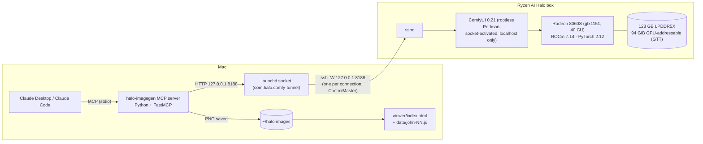

# halo-visual-bible

Code behind an illustrated "Visual Bible" of the Gospel of John: **88 scenes and 2 cast portraits,
~190 images**, all generated locally on an AMD Ryzen AI Halo box (Ryzen AI Max+ 395, Radeon 8060S)
with ComfyUI, and driven conversationally from Claude through a small MCP server.

## Architecture



1. Claude calls a tool such as `halo_generate_image(prompt, reference_image=…)`.
2. The MCP server fills a ComfyUI API-format workflow (`workflows/`), uploads any reference image,
   queues it with `POST /prompt`, and polls `/history`.
3. Requests reach ComfyUI through an on-demand SSH tunnel: nothing is exposed on the network.
4. The PNG is saved on the Mac and a JPEG preview goes back into the chat.
5. Scenes are assembled into a static, no-build web viewer.

## Models

| Role | Model | Precision | Steps |
|---|---|---|---|
| Scene generation | FLUX.2 [klein] 4B (distilled) | BF16 | 4 |
| Character consistency | FLUX.2 [klein] + `ReferenceLatent` on a cast portrait | BF16 | 4 |
| Fixes and touch-ups | Qwen-Image-Edit 2511 + Lightning 4-step LoRA | FP8 mixed | 4 |
| (available) text rendering / fast photoreal | Qwen-Image 2512, Z-Image Turbo | FP8 / BF16 | 4 / 8 |

## Numbers from the build

| | |
|---|---|
| Book jobs | 168 (103 klein + reference, 18 klein text-only, 47 edits) → 1.87 per published image |
| GPU time for the book | 67.5 min (45 s per published image) |
| Warm timings | klein 1344×768: 8.6 s · + reference: 15.7 s · Qwen edit: 31.9 s (54.3 s after a model swap) |
| Energy per image (APU socket) | 0.28 Wh · 0.57 Wh · 1.18 Wh |
| Power | 30.6 W idle, ~156 W sustained ceiling under load |
| Electricity for the whole book | ~0.18 kWh ≈ $0.03 at $0.15/kWh |

Measured with the scripts in `scripts/`; see the blog post for details.

## Repo layout

| Folder | Contents |
|---|---|
| [`mcp-server/`](mcp-server/) | The MCP server (generate, reference images, edit, list models, LoRA training) and its model registry |
| [`workflows/`](workflows/) | ComfyUI API-format workflows with `{{PLACEHOLDER}}` fields, plus model download list |
| [`setup/`](setup/) | Step-by-step setup, ssh config, launchd tunnel plist, Claude Desktop config snippet |
| [`site/`](site/) | The public website (static, deployed on Vercel): the story, the full book, every attempt with its prompt, the numbers, and the infographic |
| [`content/`](content/) | The blog post source (`story.md`), rendered into `site/index.html` by `scripts/build_story.py` |
| [`viewer/`](viewer/) | The Visual Bible viewer as a reusable template, with one sample chapter |
| [`scripts/`](scripts/) | `comfy_history_metrics.py` (job metrics from ComfyUI history), `halo_benchmark.py` (timed runs with power/thermal telemetry), `build_site_assets.py`, `build_verse_index.py`, `build_story.py`, `render_infographic.sh` (site build helpers) |

## Quickstart

Prerequisites: a machine running ComfyUI with the models in `workflows/README.md`, reachable
over SSH; a Mac with Python 3.11+ and Claude Desktop.

```bash
git clone <this-repo> && cd halo-visual-bible

# 1. tunnel: fill in setup/ssh_config.example, then
sed "s/__USER__/$(whoami)/" setup/com.halo.comfy-tunnel.plist > ~/Library/LaunchAgents/com.halo.comfy-tunnel.plist
launchctl bootstrap gui/$(id -u) ~/Library/LaunchAgents/com.halo.comfy-tunnel.plist
curl -s http://127.0.0.1:8188/system_stats | head -c 120

# 2. MCP server
python3 -m venv mcp-server/.venv && mcp-server/.venv/bin/pip install -r mcp-server/requirements.txt

# 3. register: merge setup/claude_desktop_config.snippet.json into
#    ~/Library/Application Support/Claude/claude_desktop_config.json, then restart Claude Desktop
```

Then ask Claude: *"What image models are on halo?"* Full walkthrough: [`setup/SETUP.md`](setup/SETUP.md).

## The website

`site/` is plain static HTML with no build step; Vercel serves it as-is (`vercel.json` sets
`outputDirectory: site` and clean URLs). To preview locally: `python3 -m http.server 8090 --directory site`.
After editing `content/story.md`: `uv run --with markdown python3 scripts/build_story.py`.

### Verse index (for other apps)

`/index/v1/books.json` and `/index/v1/<book>.json` (e.g.
[`/index/v1/matthew.json`](https://halo-visual-bible.vercel.app/index/v1/matthew.json)) map every
verse range to its scene image. They're served with CORS enabled and a 5-minute cache, and images are
immutable, so apps can hot-link them. Rebuild with `python3 scripts/build_verse_index.py` whenever
chapters or picks change. The schema is versioned by path; breaking changes go to `/index/v2/`.

## License

MIT for the code in this repo. Model weights are under their own licenses (the ones used here are
Apache-2.0); scripture text in the sample chapter is the King James Version (public domain).
