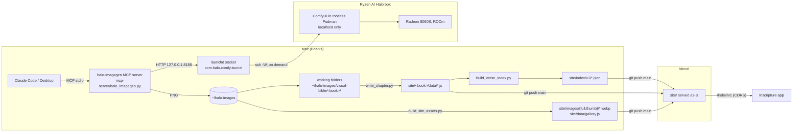

# Architecture

## System



## Components

| Part | Where | Notes |
|---|---|---|
| MCP server | `mcp-server/halo_imagegen.py`, `models.json` | Tools: `halo_generate_image`, `halo_edit_image` (param is `instruction`), `halo_wait_for_job`, `halo_list_models`, LoRA training tools. Calls longer than ~50 s return `STILL RUNNING ... prompt_id`; collect with `halo_wait_for_job`. |
| Workflows | `workflows/*.json` | ComfyUI API format with `{{PLACEHOLDER}}` fields. klein, klein + reference, Qwen edit, Qwen image, Z-Image Turbo. |
| Tunnel | `setup/` | launchd socket on the Mac opens `ssh -W` per connection. Nothing on halo listens on the network. |
| Site | `site/` | Static HTML, `vercel.json` sets `outputDirectory: site`, clean URLs, immutable cache and CORS on `/images/`, 5 min cache and CORS on `/index/`. |
| Reader reports | `api/report.js`, `site/assets/report.js` | The one server-side piece: a Vercel function (zero-config, picked up from `api/` at the repo root). It checks a report and files it as an issue in the private reports repo with a token held in Vercel env vars. The site itself stays static. |
| Story | `content/story.md` | Rendered to `site/index.html` by `scripts/build_story.py` (Books nav lives in that script's template too). |
| Viewer template | `viewer/` | The reusable single-book viewer with one sample chapter. The live book pages are copies under `site/<book>/`. |
| Scripts | `scripts/` | See [`scripts/README.md`](../scripts/README.md). |

## Models

| Role | Model | Typical time on a quiet box |
|---|---|---|
| Scenes, text only | FLUX.2 [klein] 4B, 1344x768, 4 steps | ~8.6 s |
| Scenes with a cast member | klein + `reference_image` (ReferenceLatent) | ~16.8 s |
| Portraits | klein 896x1152 | ~9 s |
| Fixes | Qwen-Image-Edit 2511 + Lightning LoRA, optional second image | ~40 to 57 s |

## Data formats

### Chapter file: `site/<book>/data/<book>-NN.js`

```js
VB.add(3,{"scenes":[[1,15,"halo_klein_ref_00807_.png","Title from the KJV","Subtitle.",0,2], ...],
          "v":["verse 1 text", "verse 2 text", ...]});
```

Scene array: `[from, to, source PNG filename, title, subtitle, trim, kind?]`.
- `trim` `1` scales the image 3% to hide the thin edge strip Qwen edits leave; use it for every edit.
- `kind` (optional) `1` parable, `2` vision.
- The page converts `.png` to `.webp` under `/images/full/`.
- The first scene of chapter 1 is the hero image, so a page shows one fewer `article.scene` than
  the scene count.

Generated by the working folder's `write_chapter.py` from `plan_src.py`, `kjv-*.json` and `picks*.json`.

### Working folder

- `plan_src.py`: `S` (or `S1`/`S2`) = list of `(chapter, from, to, title, subtitle, cast ref key)`;
  `PARABLES`, `VISIONS` = sets of `(chapter, from)`.
- `picks*.json`: `{"ch:from": ["file.png", trim]}`.
- `cast.json`: ref key to portrait filename.
- `worklog.md`: one `## <Book> ChN` section per chapter; job names `klein N`, `ref N`, `edit_N`
  (`chapter_metrics.py` and the per-book metrics split rely on that naming).

### Making of: `site/data/gallery.js`

`window.GALLERY = [{f, w, h, t, secs, kind, prompt, source[], used[], book, n}, ...]`, one entry per
generation or edit. `used` lists where an image appears (book, chapter, scene, or cast). Images
not used anywhere are tagged with the book of the nearest used image in time. Built by
`build_site_assets.py`, which keeps old entries whose jobs are gone from ComfyUI history.

### Verse index: `site/index/v1/`

- `books.json`: `{schema_version, versification, books:[{slug, name, chapters_available, scene_count, page_url, index_url}]}`
- `<slug>.json`: `{slug, name, chapters: {"N": [{id, from, to, title, subtitle, kind, full, thumb, w, h, page_url}]}}`
- Slugs match Inscripture: book name lowercased, no spaces (`1samuel`, `songofsolomon`). John's site
  folder is `bible` but its slug is `john`. Registered in `BOOKS` in `build_verse_index.py`.

### Per-job numbers: `site/data/<book>/`

`comfy_history.csv` and `history_summary.md` from `comfy_history_metrics.py`. Books done in one
session share a folder (`site/data/samuel/`). Snapshots overlap between books, so pass `--exclude`
with the other books' outputs.

## Build order for a change

1. Images and picks in the working folder, `write_chapter.py` for changed chapters.
2. `build_site_assets.py` (all books) to make WebPs and the gallery.
3. `build_verse_index.py`.
4. Numbers (`comfy_history_metrics.py`), under-the-hood table, story tables, then `build_story.py`.
5. Check locally on port 8090, then commit and push.

## Site page notes

- Books nav: `<details class="books">` in every page, grouped Old Testament then New Testament in
  canonical order. On a book's own page: `class="books current"`, `aria-current="page"`, and the
  book name as `<summary>`.
- `/under-the-hood`: the full numbers table (`#runs`, one column per book) is the single source;
  the compare view and ranking are built from it by inline JS.
- `/making-of`: filter buttons per book and a `?book=` allow-list in the inline script.
